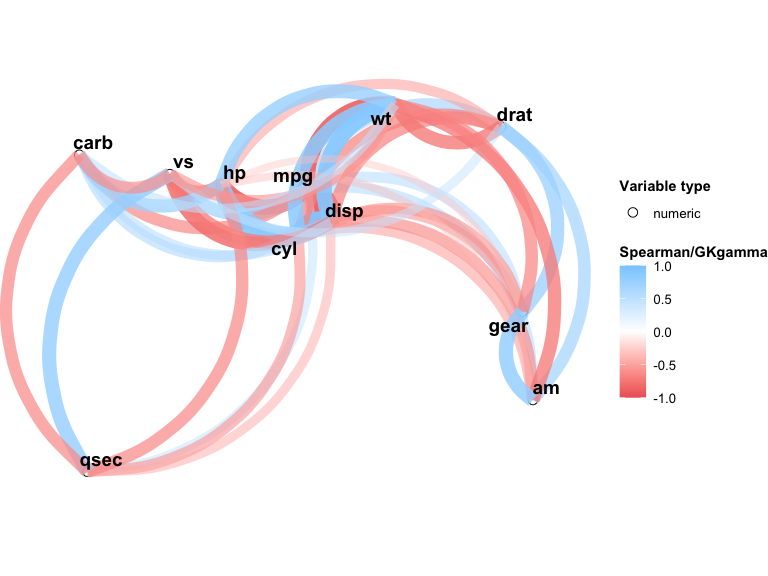
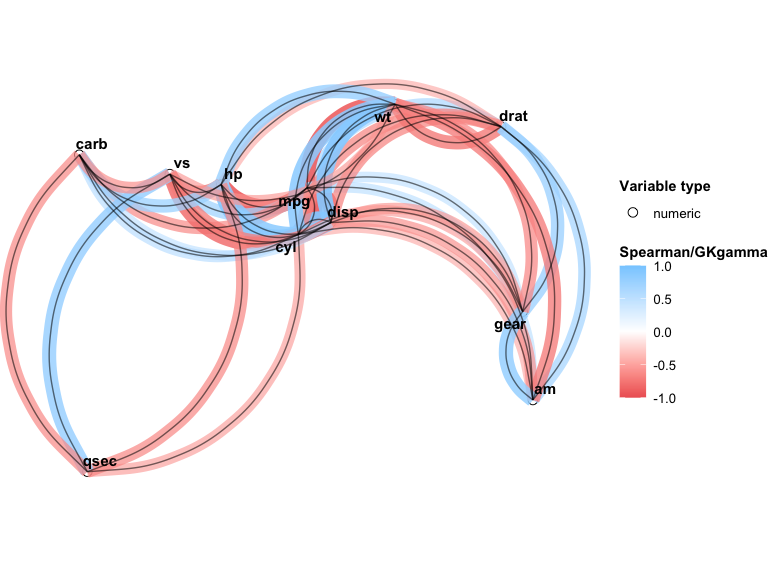

<!-- README.md is generated from README.Rmd. Please edit that file -->

# VisXplore

<!-- badges: start -->

[](https://CRAN.R-project.org/package=VisXplore)
[](https://app.codecov.io/gh/CU-Anschutz-GMWG/VisXplore?branch=master)
<!-- badges: end -->

VisXplore is an R package for interactive data preprocessing and
variable selection across mixed variable types. It computes pairwise
correlations and associations for numeric, nominal (factor), and ordinal
variables and visualizes the results as a network plot. It supports
real-time data preprocessing and presents important information for
variable selection.

VisXplore offers both a **code-forward S3 API** for use in R scripts and
notebooks, and an optional **Shiny app** for interactive exploration.

## Installation

You can install the development version of VisXplore from
[GitHub](https://github.com/) with:

``` r
# install.packages("devtools")
devtools::install_github("CU-Anschutz-GMWG/VisXplore")
```

## Pairwise association

The core function `pairwise_cor()` computes a pairwise association
matrix for all variables in a data frame. The association measure
depends on the variable types involved:

| Variable pair               | Measure                                   |
|-----------------------------|-------------------------------------------|
| Numeric vs. numeric         | Spearman rho                              |
| Factor vs. any              | Pseudo R-squared (multinomial regression) |
| Ordinal vs. ordinal/numeric | Goodman-Kruskal gamma                     |

``` r
library(VisXplore)
result <- pairwise_cor(mtcars)
result
#> Pairwise associations for 11 variables (11 numeric)
#> 45 of 55 pairs significant at p < 0.05
#> 
#> Variables: mpg, cyl, disp, hp, drat, wt, qsec, vs, am, gear, carb
```

Use `summary()` to view the full association matrix with significance
stars:

``` r
summary(result)
#> Correlation/Association Matrix
#> Significance: **** p<0.0001, *** p<0.001, ** p<0.01, * p<0.05
#> 
#>            cyl      disp        hp      drat        wt      qsec        vs
#> mpg  -0.91**** -0.91**** -0.89****  0.65**** -0.89****  0.47**    0.71****
#> cyl             0.93****   0.9**** -0.68****  0.86**** -0.57***  -0.81****
#> disp                      0.85**** -0.68****   0.9**** -0.46**   -0.72****
#> hp                                 -0.52**    0.77**** -0.67**** -0.75****
#> drat                                         -0.75****  0.09      0.45*   
#> wt                                                     -0.23     -0.59*** 
#> qsec                                                              0.79****
#> vs                                                                        
#> am                                                                        
#> gear                                                                      
#>             am      gear      carb
#> mpg   0.56***   0.54**   -0.66****
#> cyl  -0.52**   -0.56***   0.58*** 
#> disp -0.62***  -0.59***   0.54**  
#> hp   -0.36*    -0.33      0.73****
#> drat  0.69****  0.74**** -0.13    
#> wt   -0.74**** -0.68****   0.5**  
#> qsec  -0.2     -0.15     -0.66****
#> vs    0.17      0.28     -0.63****
#> am              0.81**** -0.06    
#> gear                      0.11
```

Use `plot()` to generate a network plot where node positions are derived
from MDS on the dissimilarity matrix (`1 - |association|`), and edges
represent associations above a minimum threshold:

``` r
plot(result, min_cor = 0.3)
```



You can also customize the network plot directly with `npc_mixed_cor()`:

``` r
npc_mixed_cor(result, min_cor = 0.5, show_signif = TRUE, label_size = 4)
```



## Mixed variable types

When your data includes factor or ordinal variables, specify the types
explicitly:

``` r
types <- c("numeric", "factor", rep("numeric", 5), rep("factor", 2),
           rep("ordinal", 2))
result_mixed <- pairwise_cor(mtcars, types)
result_mixed
#> Pairwise associations for 11 variables (6 numeric, 3 factor, 2 ordinal)
#> 44 of 55 pairs significant at p < 0.05
#> 
#> Variables: mpg, cyl, disp, hp, drat, wt, qsec, vs, am, gear, carb
```

## Data quality checks

Use `data_check()` to identify empty or zero-variance columns before
analysis:

``` r
df <- data.frame(x = rnorm(10), y = 1, z = NA)
data_check(df)
#> Warning: z missing for all observations
#> Warning: y with same value for all observations
```

## Interactive Shiny app

For point-and-click exploration, launch the built-in Shiny app. It
provides tabs for the network plot, variable distributions, correlation
matrix, summary statistics, and data transformations:

``` r
VisXplore(mtcars)
```

## Video walkthrough

A video walkthrough of the application has been made available, linked
to below:

[](https://www.youtube.com/watch?v=aZfLty00Mrc)
